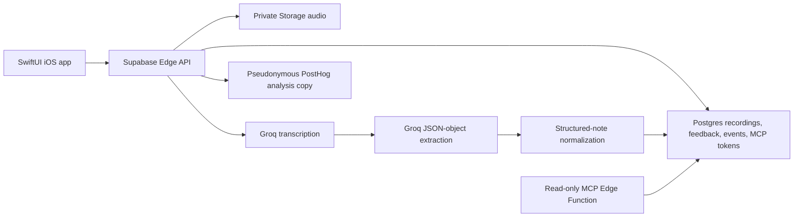

# Throughline current architecture

**Verified:** 2026-08-23 by local source inspection and the dated [flags-off production rollout](evidence/2026-08-23-evaluation-production-rollout.md), [lineage behavior canary](evidence/2026-08-23-evaluation-lineage-behavior-canary.md), and [owner-canary preflight](evidence/2026-08-23-evaluation-owner-canary-preflight.md). This is the factual current component map, not a fresh deployment attestation. Current operational facts live in [CURRENT_STATE.md](CURRENT_STATE.md); commands and maintenance procedures live in [hosted-backend.md](hosted-backend.md).

## Current data flow

## Components

### iOS client

The SwiftUI app owns capture, authentication, local event queuing, API calls, and the note UI.

- [AudioRecorder.swift](../ios/Throughline/Services/AudioRecorder.swift) records foreground audio to a temporary local file. [HomeView.swift](../ios/Throughline/Views/HomeView.swift) applies the current five-minute authenticated client cap; [OnboardingView.swift](../ios/Throughline/Views/OnboardingView.swift) runs the 30-second demo.
- [AuthClient.swift](../ios/Throughline/Services/AuthClient.swift) handles Supabase Auth. [AppState.swift](../ios/Throughline/AppState.swift) coordinates signed-in state and application data.
- [UploadClient.swift](../ios/Throughline/Services/UploadClient.swift) sends recordings and uses a persisted, bounded first-party event queue. It also calls the note-edit, action-item, extraction-feedback, product-feedback, and MCP-token API routes.
- [ThroughlineNote.swift](../ios/Throughline/Models/ThroughlineNote.swift) represents the app-side structured note.

### Supabase Edge API and data stores

[supabase/functions/api/index.ts](../supabase/functions/api/index.ts) is the app-facing Edge Function. It validates a Supabase JWT for signed-in requests, accepts recordings, stores audio in the private `throughline-audio` bucket, and persists recordings and feedback in Postgres through service-role access. Current tables/migrations include `throughline_recordings`, `throughline_feedback`, `throughline_product_events`, `throughline_product_feedback`, profiles, and MCP tokens under [supabase/migrations](../supabase/migrations).

The API exposes routes for recording creation/reads, editing a note, toggling action items, extraction feedback, product feedback, event ingestion, account deletion, MCP-token management, and protected maintenance. With evaluation behavior controls absent/off, its ordinary recording-processing, note-edit, and action-item routes mutate current recording data rather than creating immutable edit or processing revisions.

The deployed flags-off TL-EVAL foundation extends this Supabase boundary without adding a provider. The schema, API, private-artifact deletion function, and protected reconciliation schedule exist in production, while the user-behavior controls remain absent/off. Feature-gated API paths can write immutable lineage and owner-derived evaluation state; the offline materializer can publish receipt-scoped private objects to `throughline-audio/evaluation-artifacts`; and [private-artifact-delete/index.ts](../supabase/functions/private-artifact-delete/index.ts) deletes only that exact receipt prefix. The API derives the sibling function's same-project route and exposes service-only stale-receipt reconciliation with database-issued cleanup leases. No real private corpus has been materialized. The exact live-fact boundary is recorded in [CURRENT_STATE.md](CURRENT_STATE.md); operational sequencing is in [hosted-backend.md](hosted-backend.md).

### Processing pipeline

For audio recordings, the API uploads audio, requests Groq transcription, then requests Groq extraction with JSON-object response mode. The server normalizes the resulting fields and derives presentation-friendly structure before persisting the resulting structured note. The live-code defaults are `whisper-large-v3-turbo` for transcription and `openai/gpt-oss-120b` for extraction; see [CURRENT_STATE.md](CURRENT_STATE.md) for the verification boundary.

[core/extraction-pipeline.mjs](../core/extraction-pipeline.mjs) is the shared extraction-normalization logic used for local/core validation. The Edge API contains the deployed runtime equivalent. The ordinary flags-off real-user path does not continuously create immutable processing lineage; a bounded production canary proved that the gated path can persist the exact contract, attempts, original revision, and related hashes before the flag returned off.

### Product events and analysis

The iOS event queue writes privacy-safe first-party product events to `throughline_product_events` through the API. The API can create a server-side pseudonymous copy in PostHog using [supabase/functions/_shared/posthog.ts](../supabase/functions/_shared/posthog.ts). Supabase is the first-party event store; PostHog is an analysis copy, not the canonical event record. See [product/metrics.md](../product/metrics.md) for definitions and [CURRENT_STATE.md](CURRENT_STATE.md) for the mixed-traffic baseline caveats.

### Agent access

[supabase/functions/mcp/index.ts](../supabase/functions/mcp/index.ts) provides the hosted MCP endpoint. Its tool declarations are read-only and it scopes user-token requests to the token owner. The memory tools live in [supabase/functions/_shared/memory-tools.ts](../supabase/functions/_shared/memory-tools.ts). The client setup instructions are in [agent-connect.md](agent-connect.md).

## Current versus target

Current real-user behavior is a synchronous, Edge-Function-centered pipeline with flags-off current-state mutation and aggregate telemetry. The deployed foundation contains versioned-lineage and private-evaluation infrastructure, but those behavior paths are not continuously enabled for real traffic and there is no independent real-audio quality result. Throughline is **not yet** a continuously active learning loop, a durable capture outbox, a server-enforced daily recording allowance, or a writable/permissioned agent action system. Those are potential future slices only; this document does not authorize or imply their implementation.

## Runbook boundaries

Keep deployment commands, environment variables, health/canary checks, and retention operations in [hosted-backend.md](hosted-backend.md). Runbooks should link here instead of re-describing component topology; live release and provider facts must be re-verified in [CURRENT_STATE.md](CURRENT_STATE.md).
