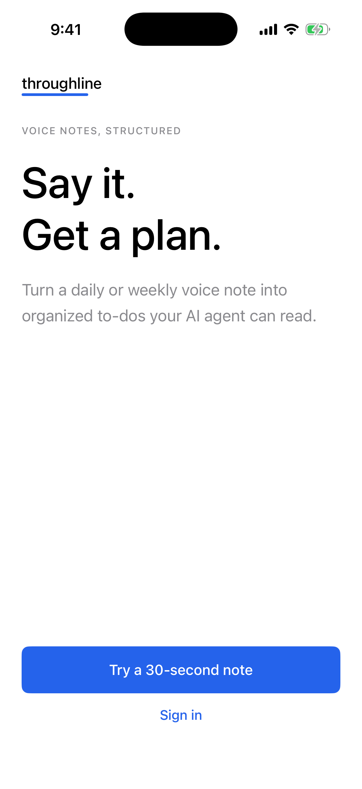
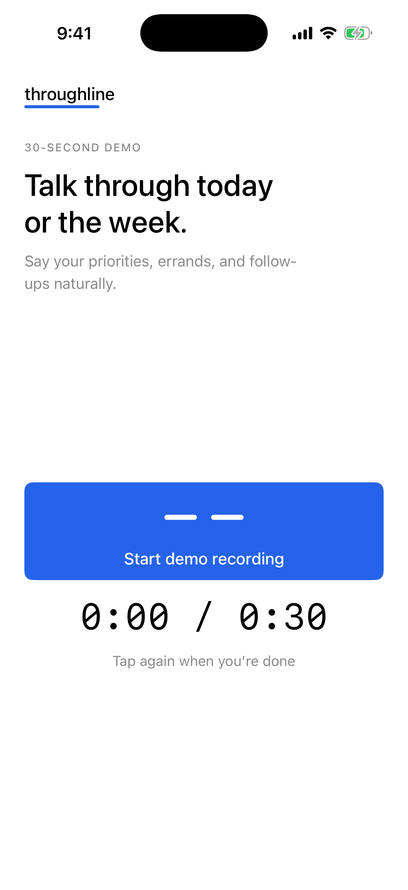
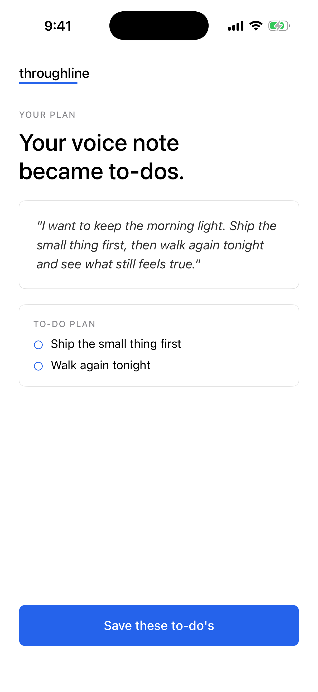
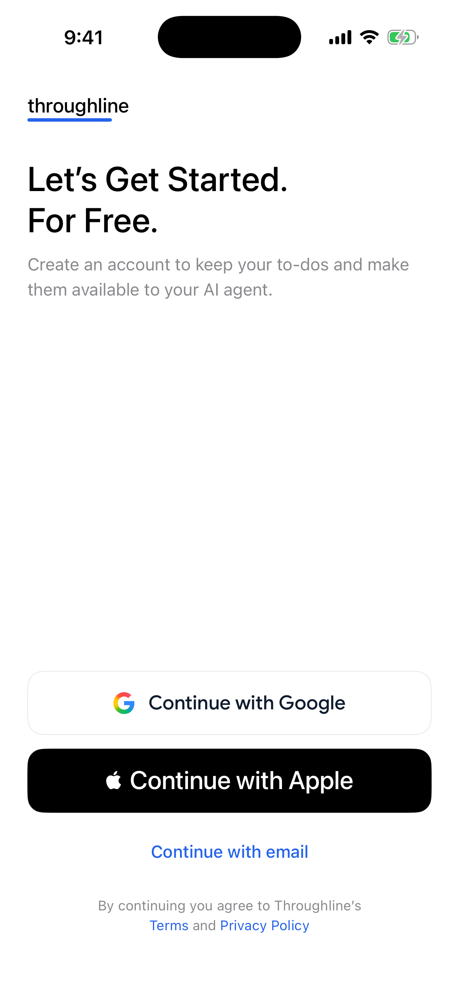
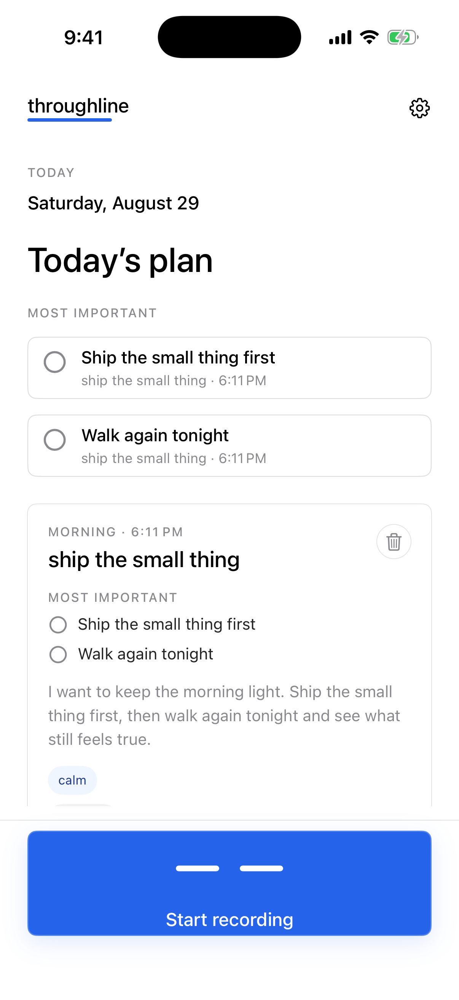

# Design, product direction, and feature-portfolio audit

**Audit date:** 2026-08-29  
**Mode:** Combined product-experience, visual-system, accessibility-risk, direction, and backlog audit  
**Runtime evidence:** Fresh Debug Simulator build from an isolated copy of the current dirty iOS tree; unsigned build succeeded. Screens were launched through existing debug preview arguments on the dedicated `Throughline Screenshot QA` simulator and inspected after capture.  
**Authority:** This audit identifies drift and recommends gates. It does not select a redesign, reprioritize the portfolio, approve implementation, or change external state.

## Verdict

Throughline has a distinctive and coherent visual idea: quiet monochrome, one meaningful blue, generous space, a branded recorder, and a clear voice-to-structure transformation. Onboarding expresses that idea well. The signed-in Home surface does not: it repeats the same actions at multiple levels, exposes too much note detail at once, and does not visibly respond to the Simulator's largest accessibility text setting.

The durable product vision is also coherent, but its immediate wedge was implicit. The canonical cleanup now expresses one outcome ladder in `docs/PRODUCT.md`, keeps visual judgment in `throughline-brand-decisions.md`, and keeps portfolio priority and the next Mike-owned decision in `product/backlog.json`.

## Fresh visual flow

### 1. Value proposition — healthy

The hierarchy is immediate: brand, promise, concrete explanation, one dominant trial action, and a quieter sign-in path. The screen feels specifically like Throughline. The main unresolved risk is not visible at this size: fixed font sizes make accessibility scaling unreliable.

### 2. Voice capture — healthy with motion risk

The full-width blue recorder is distinctive and unmistakable, with a clear 30-second boundary. Recording animations repeat indefinitely in source without checking Reduce Motion, so the visual state is strong but the accessibility behavior is not complete.

### 3. Structured result — mostly healthy

This is the clearest expression of the product: source language and extracted actions are visible together. The bottom action uses the incorrect plural `to-do's`; the canonical term is `to-dos`. The task circles also look interactive but their target behavior still needs runtime accessibility verification.

### 4. Account handoff — mixed

Google and Apple read as confident provider actions. Email is visually demoted into an unrelated text-link treatment even though it is a peer account path. This also contradicts the historical design-QA record that describes a shared outlined provider family; that record is not current-state evidence.

### 5. Populated Home — needs revision before expansion

The persistent recorder remains clear, but Home repeats the same two actions in the top plan and the source card, repeats the source title beneath each task, then adds title, metadata, prose, tags, note actions, and later review controls. The result conflicts with the canonical rules of one role per item and progressive disclosure. Compact task and delete controls are also smaller than the documented 44-point minimum in source.

### 6. Home at the largest accessibility text setting — unhealthy

The Simulator was changed to `accessibility-extra-extra-extra-large` and Home was relaunched. Visible app typography remained effectively unchanged because the view layer relies broadly on fixed `.system(size:)` values. This is direct evidence that the current typography system does not honor the user's requested reading size on this surface. It is not a full accessibility-compliance test.

## Highest-impact design findings

1. **Home hierarchy is the main visual problem.** `HomeView.swift` renders top-level important items and repeats those actions inside the source card, while the card can also show preview, transcript, pills, open, delete, and grading controls. Fix the role and disclosure model before styling another task-home candidate.
2. **Accessibility principles are not encoded as reusable components.** Current task toggles use 26-point frames, card delete uses 30 points, and grade controls use 30- or 34-point heights (`ios/Throughline/Views/HomeView.swift:727`, `:835`, `:1022`, `:1307`, `:1623`).
3. **Typography is fixed rather than semantic.** The current view and theme layer contains 107 fixed-size `.system(size:)` uses. The largest-text capture confirms the consequence on Home.
4. **Reduce Motion is not observed by the signature recorder.** Both Home and onboarding start repeating rotation animations without consulting the accessibility environment (`ios/Throughline/Views/SharedComponents.swift:920`, `ios/Throughline/Views/OnboardingView.swift:1242`).
5. **Provider hierarchy and its documentation drifted apart.** Google is a 56-point outlined provider control while Email is a 44-point blue text action (`ios/Throughline/Views/OnboardingView.swift:1048`, `:1078`). Mike should decide whether that asymmetry is intentional before the next auth polish slice.

## Product direction audit

The durable direction is:

`lossless voice capture → trustworthy structured knowledge → return and reuse → owner-controlled agent read → future permissioned action`

Only the first four are part of the durable current promise, and agent write-back remains a future hypothesis. The evidence-backed immediate portfolio question is whether to select capture durability and truthful saved or agent-readable state before another Home redesign. That is a Mike-owned priority decision, not an audit conclusion that authorizes a build.

## Feature portfolio audit

The backlog covers acquisition, activation, capture reliability, transcription, extraction, learning, task Home, knowledge retrieval, agent connection, feedback, cost, and monetization. The cleanup adds the core-quality program's previously missing personalization candidate as evidence-only and unselected.

Remaining portfolio weaknesses:

- dependencies name enabling items but not the milestone that satisfies them;
- evidence dates range from 2026-08-07 to 2026-08-29, so file freshness must not be mistaken for item freshness;
- several measuring items still describe open-ended monitoring rather than a source, window, readiness floor, and review date;
- `approval_required` is too coarse to express whether the immediate next step is agent-owned evidence work or a Mike-owned decision;
- some next actions still combine preparation, approval, and external execution.

The next schema cleanup should add dependency-gate semantics, evidence refresh triggers, and next-decision ownership without reordering Mike's portfolio.

## Canonical decisions and boundaries after cleanup

| Need | Canonical source | Boundary |
| --- | --- | --- |
| Product vision, user, outcome ladder, differentiation, non-goals | `docs/PRODUCT.md` | Durable intent; no runtime or priority claims. |
| Look, feel, voice, components, design checks | `throughline-brand-decisions.md` | Guides proposals; Mike still selects taste and visual targets. |
| Feature priority, evidence, dependency, state, next gate | `product/backlog.json` | Mike owns priority and build entry. |
| Product/design decision packet and slice lifecycle | `docs/WORKFLOW.md` | Audits recommend; they do not approve. |
| Current installed, runtime, release, and operational facts | `docs/CURRENT_STATE.md` | Every live fact requires a verification date and evidence link. |

## Evidence limits

- These are fresh Simulator preview states, not an installed TestFlight journey or physical-device session.
- Microphone capture, provider completion, failure recovery, scrolling, focus order, VoiceOver announcements, dark mode, Increase Contrast, and Reduce Motion were not exercised end to end.
- Screenshots support visual and hierarchy findings; source inspection supports control-size, typography, and motion risks. Neither establishes full accessibility compliance.
- The shared checkout was already heavily dirty. This audit changed only documentation, backlog structure/content, and its new visual evidence; it did not stage, clean, revert, deploy, publish, or submit anything.
